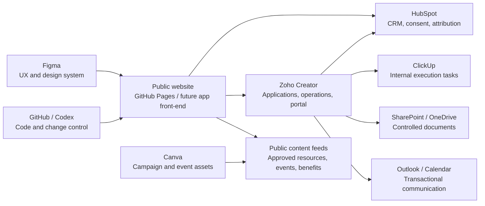

# TenXHouse Website Operating Model

## Status

Implementation baseline for review. This document reflects the confirmed corrections made during the website audit. Commercial, legal and service-level details marked as approval dependencies must not be published as facts until approved.

## Confirmed business model

TenXHouse:

- hosts TenOne Venture Group, Xcolab Africa, PrintaLa and KaMuntu;
- is not a coworking, hot-desk, meeting-room or venue-hire business;
- provides a membership and professional business-presence proposition;
- gives members access to selected, approved benefits from hosted companies and partners;
- must be a useful source of practical information for entrepreneurs;
- must maintain a dedicated Events tab for relevant TenXHouse, hosted-company, partner and curated external events.

## Jobs the website must perform

1. Explain the business model accurately in the first screen.
2. Convert qualified prospects into membership applications.
3. Distinguish TenXHouse services from services delivered by hosted companies and partners.
4. Make approved member benefits tangible without exposing uncontrolled discount codes.
5. Publish useful, source-led entrepreneur resources.
6. Publish and manage relevant events without implying venue hire.
7. Route each interaction into the correct operational system.
8. Build trust using verified proof, clear terms and working workflows.

## Recommended system architecture

## Source-of-truth decisions

| Information or workflow | System of record | Website role |
|---|---|---|
| Prospect/contact and company | HubSpot | Capture consent/source and pass through approved forms |
| Membership application and status | Zoho Creator | Explain and launch the application |
| Member profile and eligibility | Zoho Creator | Secure portal only |
| Membership package catalogue | Zoho Creator or approved configuration record | Display approved, public fields |
| Hosted companies | Zoho Creator public registry or approved JSON | Display public, approved profiles |
| Member benefits | Zoho Creator | Display public summary; claim in portal |
| Benefit claims and redemptions | Zoho Creator | Never expose private claim data |
| Event catalogue and registrations | Zoho Creator | List published events; route RSVP |
| Marketing consent and campaign attribution | HubSpot | Use HubSpot forms or synchronised consent fields |
| Long-form resource copy | GitHub Markdown or approved CMS; source files in SharePoint | Publish approved pages |
| Resource metadata and review dates | Zoho Creator | Use public approved feed or build export |
| Internal delivery tasks | ClickUp | No task management on public site |
| Contracts, evidence and sensitive files | SharePoint / OneDrive | Link from protected operational records only |
| Email and calendar | Outlook / Microsoft 365 | Provide calendar actions and approved communication triggers |
| UX/UI source | Figma | Implement approved components |
| Campaign artwork | Canva | Use exported, approved assets |
| Website code and releases | GitHub / Codex | Deploy reviewed code only |

## Critical integration rule

The public website is static and runs in the visitor's browser. It must not contain OAuth client secrets, HubSpot private app tokens, Microsoft Graph secrets or any protected Zoho Creator credential.

Allowed public integration patterns:

1. Link or embed a published Zoho Creator form/page.
2. Link or embed a HubSpot form.
3. Read sanitised public data from an approved published endpoint.
4. Call a secured server-side integration layer that holds secrets outside the browser.

Protected Creator API calls must be executed server-side or inside the Creator application, not in public browser code.

## Public journeys

### Membership

1. Visitor reads approved package information.
2. Visitor starts a Zoho Creator application.
3. Creator validates fields and creates an application reference.
4. HubSpot contact is created or updated using a stable sync key.
5. Internal review tasks are created only when required.
6. Approved documents are routed to SharePoint or the approved protected store.
7. Payment step is completed through the provider still to be approved.
8. Creator activates membership and portal access.
9. Renewal, support and benefit eligibility remain in Creator.

### Resource subscriber

1. Visitor reads a public resource.
2. Visitor submits a HubSpot form for a download or newsletter.
3. HubSpot stores consent, source page and campaign.
4. Relevant engagement data is passed to Creator only when it changes an operational workflow.

### Event registration

1. Website displays an event marked `Published` in Creator.
2. Visitor opens the Creator RSVP form or approved registration page.
3. Creator checks capacity, membership eligibility and duplicate registrations.
4. HubSpot receives or updates the contact and campaign participation signal.
5. Outlook/Calendar details are sent or generated.
6. Attendance and follow-up outcomes are recorded after the event.

### Member benefit claim

1. Member signs into the Creator portal.
2. Creator checks active status and benefit eligibility.
3. Creator issues a claim reference or verified provider referral.
4. Provider fulfils the benefit under its own service terms.
5. Redemption, value and outcome are recorded.

## Data synchronisation rules

- Use one durable contact key. Recommended: HubSpot contact ID stored in Creator, with email used only for initial matching.
- Do not build uncontrolled two-way synchronisation.
- HubSpot owns marketing consent and lifecycle properties.
- Creator owns operational status and membership eligibility.
- ClickUp receives task summaries and links, not full customer records or unnecessary personal information.
- SharePoint stores documents; Creator stores the document reference, status and metadata.
- All sync attempts must write to a `Sync Log` with timestamp, record, target, result and error message.

## Website information architecture

Primary navigation:

1. Home
2. Membership
3. Member Benefits
4. Hosted Companies
5. Resources
6. Events
7. About
8. Join TenXHouse

Supporting pages:

- FAQ
- Privacy
- Terms
- Member portal link
- Partner application link

## Content and events governance

Resources are organised around the tasks entrepreneurs need to complete: Start, Formalise, Run, Sell, Digitalise, Fund and Grow. Every published item needs an owner, source ledger, reviewer, publication date and review date. Legal, tax, finance, funding, POPIA, labour and regulated-industry content requires specialist review.

The Events tab may include TenXHouse, hosted-company, partner and curated external events. Every listing must identify the organiser, delivery format, registration owner, price, member benefit, cancellation terms and data owner. It must not advertise venue hire.

## Design-to-build workflow

1. Page purpose and conversion requirement are documented.
2. Figma contains the approved desktop/mobile layout and component states.
3. Canva supplies approved campaign and editorial assets within the Figma system.
4. Code is implemented in a feature branch.
5. Codex or the developer runs accessibility, responsive, link and integration tests.
6. The pull request records test results and unresolved approvals.
7. Merge to `main` triggers GitHub Pages deployment.

## Release gates

The website must not be made indexable or merged to production until:

- all coworking, meeting-room, venue and tour language is removed;
- real legal entity and contact information is approved;
- membership packages and prices are signed off;
- hosted-company profiles are approved;
- at least three member benefits have complete terms;
- at least six useful resources are fully written, sourced and reviewed;
- the Events tab contains approved upcoming content or a deliberate, useful empty state;
- every CTA has a working destination;
- HubSpot and Creator duplicate-handling is tested;
- POPIA notice and membership terms are approved;
- mobile, accessibility, analytics and form QA are complete.
